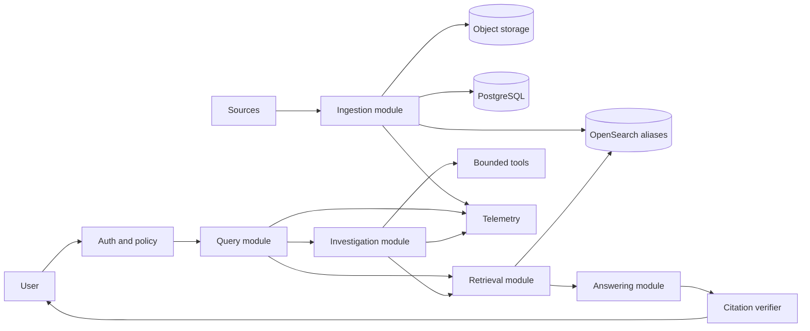

# Production RAG Platform Design

**Spec**: `.specs/features/production-rag-platform/spec.md`
**Status**: Draft

## Architecture Overview

The system starts as a modular monolith with two processes: a synchronous API and an asynchronous worker. PostgreSQL and object storage are authoritative. OpenSearch is a versioned, rebuildable retrieval projection. `Ask` is deterministic and latency-bounded. `Investigate` is an explicitly budgeted asynchronous workflow.



## Module Interfaces

| Module | Small public interface | Hidden implementation |
| --- | --- | --- |
| Ingestion | `submit(source, tenant, policy) -> JobId`; `get_job(id) -> JobState` | deduplication, parsing, chunking, storage, retries, DLQ and indexing |
| Retrieval | `retrieve(QueryContext) -> EvidenceSet` | authorization filters, BM25, vectors, fusion, reranking and score diagnostics |
| Answering | `answer(Question, EvidenceSet) -> GroundedAnswer` | context packing, model invocation, abstention and citation generation |
| Verification | `verify(GroundedAnswer, EvidenceSet) -> VerificationResult` | citation resolution, claim support checks and status assignment |
| Investigation | `start(Task, Budget) -> InvestigationId`; `get(id) -> InvestigationReport` | graph state, tools, retries, stopping rules and checkpoints |
| Policy | `authorize(Principal, ResourceAction) -> Decision` | tenant rules, document ACLs and audit reasons |
| Evaluation | `run(Suite, Candidate) -> EvaluationReport` | datasets, metrics, judge adapters, bootstrap comparison and artifacts |

Adapters will be introduced only at seams where behavior actually varies. The initial provider gets an internal interface for testability; a second production adapter is not implemented speculatively.

## Data Model

| Entity | Essential fields |
| --- | --- |
| Tenant | id, name, retention policy |
| Principal | id, tenant_id, roles, groups |
| Source | id, tenant_id, type, external_ref, policy, sync cursor |
| Document | id, tenant_id, source_id, canonical key, lifecycle state |
| DocumentVersion | id, document_id, content hash, source timestamp, effective interval, raw object ref, parser version |
| Chunk | id, document_version_id, ordinal, span, content hash, chunker version, metadata |
| IndexBuild | id, corpus version, schema version, embedding version, state, metrics |
| IngestionJob | id, idempotency key, state, attempts, error class, timestamps |
| Evidence | chunk id, document version, span, scores, retrieval strategy, authorization decision |
| Answer | id, question, evidence ids, citations, verification state, usage |
| Investigation | id, budget, state, steps, evidence ids, stop reason, usage |
| EvaluationRun | id, dataset version, candidate config, metrics, artifacts, promotion decision |

## State Machines

```text
Ingestion: queued -> fetching -> parsing -> indexing -> completed
                         |           |           |
                         +-----------+-----------+-> retrying -> failed/DLQ

Investigation: queued -> running -> completed
                         |    |-----> partial_budget_exhausted
                         |----------> failed
                         +----------> cancelled
```

Invalid transitions fail explicitly and produce an audit event.

## Error and Degraded-Mode Strategy

| Failure | Behavior | User impact |
| --- | --- | --- |
| Embedding provider unavailable | Skip dense leg when policy allows | BM25-only result marked degraded |
| Generation provider unavailable | Return evidence without generated synthesis | Search remains available |
| Object store unavailable | Use one transport attempt; let the ingestion job own bounded retries and open the circuit after repeated failures | Source becomes retrying or failed/DLQ without request amplification |
| Telemetry backend unavailable | Drop the failed signal and preserve the business result or original business error | Request continues; telemetry backend health is monitored independently |
| OpenSearch unavailable | Fail retrieval readiness; do not fabricate an answer | Explicit temporary failure |
| Parsing failure | Bounded retry, then DLQ | Source status identifies failed document |
| Partial index build | Keep old alias active | No half-built corpus served |
| Citation verification failure | Mark answer unverified or abstain | Unsupported answer is not presented as verified |
| Agent tool timeout | Record failure and continue only if remaining evidence is sufficient | Partial report includes limitation |

Embedding and generation SDK retries remain disabled. Their application services
own the small retry budget. Circuit breakers count those attempts, reject calls
during the recovery window and allow one half-open probe. This keeps timeout,
retry and fallback behavior explicit at one layer instead of multiplying attempts
across SDKs, services and jobs.

## Deployment Shape

- `local`: Docker Compose with API, worker, PostgreSQL, OpenSearch, MinIO, Redis and telemetry dependencies.
- `pilot`: Terraform-managed AWS environment with ECS Fargate API/worker, RDS PostgreSQL, S3, a reduced Amazon OpenSearch Service domain, load balancing, secrets and telemetry.
- `production-ha`: ECS services and managed data stores distributed across Availability Zones, RDS Multi-AZ, Amazon OpenSearch Service Multi-AZ with Standby, versioned S3, managed queueing, WAF, backups and tested recovery.
- `api`: FastAPI, stateless and independently scalable from workers.
- `worker`: asynchronous ingestion and investigation jobs; local broker and managed AWS broker remain behind worker configuration.
- `postgres`: authoritative metadata, state and audit records.
- `object-store`: immutable raw and normalized document artifacts.
- `opensearch`: retrieval indexes behind versioned aliases.
- `telemetry`: OpenTelemetry-compatible collection and dashboards.

Production HA is a target profile, not an always-on development expense. The Pilot profile must remain upgradable through Terraform without changing module interfaces.

## Risks and Mitigations

| Concern | Impact | Mitigation |
| --- | --- | --- |
| Empty codebase leaves commands provisional | Gates could document commands that do not exist | Fase 0 must implement and execute every command before feature work |
| Public corpus may not contain real postmortems or ACLs | Demo may underrepresent enterprise complexity | Add curated synthetic tenant fixtures and clearly label them |
| LLM-as-judge instability | Flaky promotion decisions | Pin prompts/models, include deterministic checks and human-labeled holdout set |
| OpenSearch mapping changes | Reindex downtime or inconsistent results | Immutable index versions and alias switch after eval |
| Prompt injection in corpus | Tool abuse or data disclosure | Treat content as data, enforce policy outside the model and adversarially test |
| Agent cost and tail latency | Poor production economics | Async execution, strict budgets and baseline promotion rule |

## Technical Decisions

| Decision | Choice | Rationale |
| --- | --- | --- |
| Initial architecture | Modular monolith plus worker | Best balance of locality and independent scaling |
| Durable source of truth | PostgreSQL plus object storage | Search indexes must be reconstructible |
| Retrieval engine | OpenSearch | Demonstrates lexical, vector, filter and hybrid search in one engine |
| Delivery discipline | Tests co-located with behavior; three gates | Prevents unverified code and enforces pre-push confidence |
| Agent execution | Separate asynchronous path | Avoids imposing agent cost and variability on simple questions |
